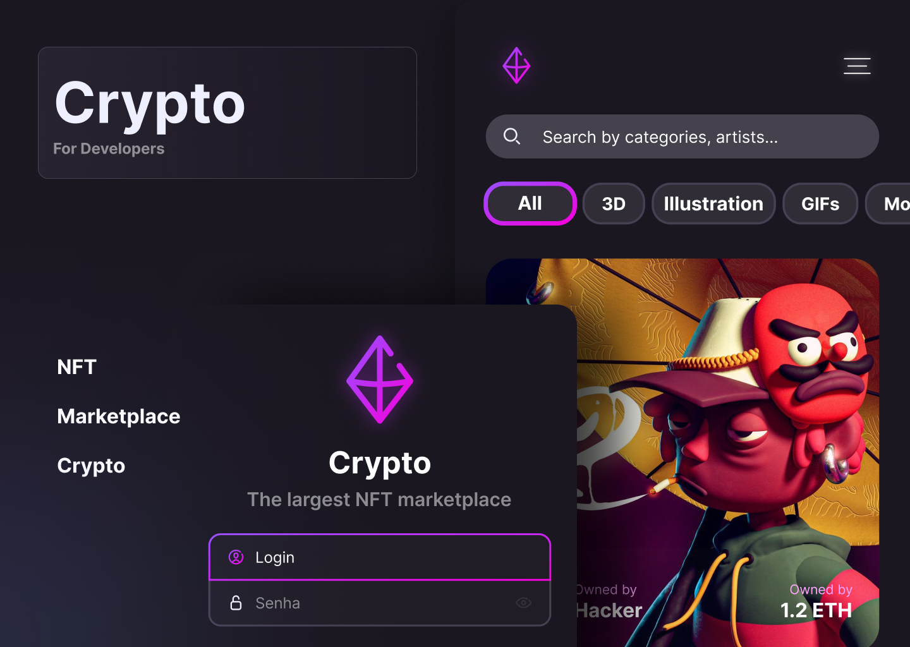

# Crypto Marketplace

Buy and use your favorite NFT on the biggest NFT marketplace 🚀<br />

<p align="center">
  
</p>

# About

<p align="center">
  
</p>

This project was developed using Stitches, tests, Storybook and GraphQL.

# Tecnologies

- [TypeScript](https://www.typescriptlang.org/)
- [NextJS](https://nextjs.org/)
- [Stitches](https://stitches.dev/)
- [Jest](https://jestjs.io/)
- [React Testing Library](https://testing-library.com/docs/react-testing-library/intro)
- [Storybook](https://storybook.js.org/)
- [Husky](https://github.com/typicode/husky)

## Getting Started

First, run the development server:

```bash
npm run dev
# or
yarn dev
```

Open [http://localhost:3000](http://localhost:3000) with your browser to see the result.

## Commands

- `dev`: runs your application on `localhost:3000`
- `build`: creates the production build version
- `start`: starts a simple server with the build production code
- `lint`: runs the linter in all components and pages
- `test`: runs jest to test all components and pages
- `test:watch`: runs jest in watch mode
- `storybook`: runs storybook on `localhost:6006`
- `build-storybook`: create the build version of storybook
- `generate`: generate code from GraphQL schema and operations

<br />

By <a href="https://www.linkedin.com/in/gabrielcastilhov" target="_blank"> Gabriel Castilho 👋🏽 </a>. <br />
